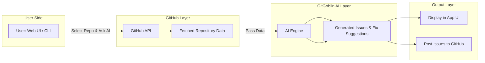

# 🧙‍♂️ GitGoblin
> Your mischievous Git assistant — automate, clean, and supercharge your repositories.

[](#)
[](#contributing)
[](https://git-goblin.vercel.app/)

---


## 📌 Overview
GitGoblin is an AI-powered GitHub companion that helps you **understand, diagnose, and improve your repositories**.  

With GitGoblin, you can:  
- 🤖 Fetch repositories directly from GitHub and analyze them with **AI-driven insights**.  
- 🪄 Automatically **generate GitHub issues** with detailed descriptions and suggested fixes.  
- 💡 Get recommendations on **how to resolve bugs, improve code quality, and enhance project structure**.  
- 📌 Push generated issues directly to your GitHub repository or review them inside the app.  

Whether you’re maintaining a personal project or managing dozens of repositories, GitGoblin’s **clean web UI and powerful AI engine** streamline the process so you can focus on building instead of manually triaging issues.

---

## 🌐 Live Demo
Try it out: **[git-goblin.vercel.app](https://git-goblin.vercel.app/)**

---

## 📷 Screenshots
### Dashboard


### Repo Cleanup


---

## 📂 Table of Contents
- [Overview](#-overview)
- [Live Demo](#-live-demo)
- [Screenshots](#-screenshots)
- [Installation](#-installation)
- [Usage](#-usage)
- [Features](#-features)
- [Architecture](#-architecture)
- [Contributing](#-contributing)


---

## ⚡ Installation

### Prerequisites
- **Node.js** >= 18.x
- **Git** installed
- (Optional) GitHub Personal Access Token

### Install Globally
```bash
npm install -g gitgoblin
```

### Or Run via NPX
```bash
npx gitgoblin init
```

---

## 🛠 Usage

### Initialize a New Project
```bash
gitgoblin init
```

### Clean Up a Repository
```bash
gitgoblin cleanup --stale-branches 90
```

### Generate a Release
```bash
gitgoblin release --tag v1.2.0
```

*(For the full CLI reference, see [`docs/cli.md`](docs/cli.md))*

---

## ✨ Features
- **AI-Powered Repo Analysis** – understand repository health, structure, and improvement opportunities.  
- **Automated Issue Generation** – create detailed GitHub issues with fix suggestions.  
- **Direct GitHub Integration** – fetch repositories and push issues instantly.  
- **Clean Web Interface** – browse AI insights and manage generated reports visually.  

---


## 🧩 Architecture



---


## 🤝 Contributing
I welcome contributions!

1. Fork the repo
2. Create your feature branch  
   ```bash
   git checkout -b feature/amazing-feature
   ```
3. Commit your changes  
   ```bash
   git commit -m "feat: add amazing feature"
   ```
4. Push to the branch  
   ```bash
   git push origin feature/amazing-feature
   ```
5. Open a Pull Request

*(Follow [Conventional Commits](https://www.conventionalcommits.org/) for commit messages.)*

---


