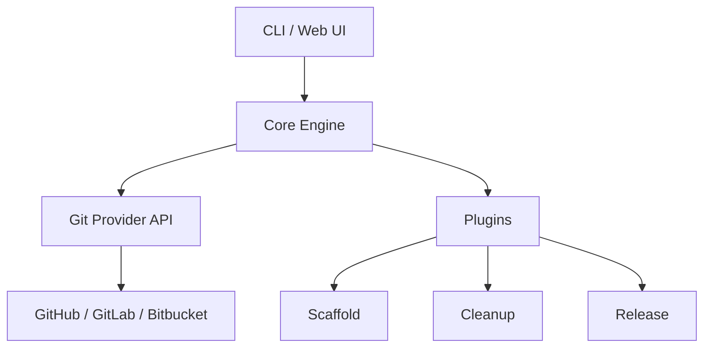

# 🧙‍♂️ GitGoblin
> Your mischievous Git assistant — automate, clean, and supercharge your repositories.

[](#)
[](LICENSE)
[](#contributing)
[](https://git-goblin.vercel.app/)

---

## 📌 Overview
**GitGoblin** is a powerful Git/GitHub companion that automates common repository tasks like:
- 🚀 **Project scaffolding** for new repositories.
- 🧹 **Cleanup & hygiene** (stale branches, unmerged PRs, unused assets).
- 📝 **Release utilities** (changelogs, tags, version bumps).
- 📊 **Analytics** and repository insights.

With a clean interface and powerful CLI, GitGoblin keeps your repo tidy so you can focus on building.

---

## 🌐 Live Demo
Try it out: **[git-goblin.vercel.app](https://git-goblin.vercel.app/)**

---

## 📷 Screenshots

### Dashboard


### Repo Cleanup


*(Replace these images with actual screenshots from your project UI.)*

---

## 📂 Table of Contents
- [Overview](#-overview)
- [Live Demo](#-live-demo)
- [Screenshots](#-screenshots)
- [Installation](#-installation)
- [Usage](#-usage)
- [Features](#-features)
- [Configuration](#-configuration)
- [Architecture](#-architecture)
- [Roadmap](#-roadmap)
- [Contributing](#-contributing)
- [License](#-license)

---

## ⚡ Installation

### Prerequisites
- **Node.js** >= 18.x
- **Git** installed
- (Optional) GitHub Personal Access Token

### Install Globally
```bash
npm install -g gitgoblin
```

### Or Run via NPX
```bash
npx gitgoblin init
```

---

## 🛠 Usage

### Initialize a New Project
```bash
gitgoblin init
```

### Clean Up a Repository
```bash
gitgoblin cleanup --stale-branches 90
```

### Generate a Release
```bash
gitgoblin release --tag v1.2.0
```

*(For the full CLI reference, see [`docs/cli.md`](docs/cli.md))*

---

## ✨ Features
- **Scaffolding** – create consistent repo structures in seconds.
- **Branch Cleanup** – remove merged or stale branches.
- **Release Management** – auto-generate changelogs and tags.
- **Analytics** – visualize repository activity.
- **Integrations** – GitHub Actions, Conventional Commits, and more.

---

## ⚙ Configuration

GitGoblin can be configured via:
1. `gitgoblin.config.json` (or `.yaml`)
2. Environment variables
3. CLI flags (highest priority)

**Example:**
```json
{
  "github": {
    "token": "YOUR_GITHUB_TOKEN",
    "owner": "YOUR_USERNAME",
    "repo": "YOUR_REPO"
  },
  "features": {
    "scaffold": true,
    "cleanup": true,
    "releases": true
  }
}
```

---

## 🧩 Architecture



---

## 🗺 Roadmap
- [ ] Multi-Git provider support (GitLab, Bitbucket)
- [ ] Advanced analytics dashboard
- [ ] Plugin marketplace
- [ ] Team collaboration mode

---

## 🤝 Contributing
We welcome contributions!

1. Fork the repo
2. Create your feature branch  
   ```bash
   git checkout -b feature/amazing-feature
   ```
3. Commit your changes  
   ```bash
   git commit -m "feat: add amazing feature"
   ```
4. Push to the branch  
   ```bash
   git push origin feature/amazing-feature
   ```
5. Open a Pull Request

*(Follow [Conventional Commits](https://www.conventionalcommits.org/) for commit messages.)*

---

## 📜 License
MIT License © 2025 [Your Name]  
See [LICENSE](LICENSE) for details.

